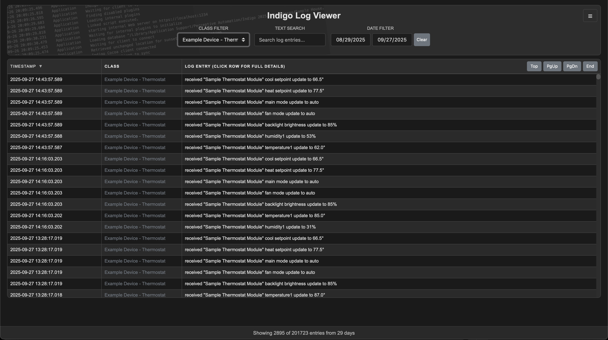
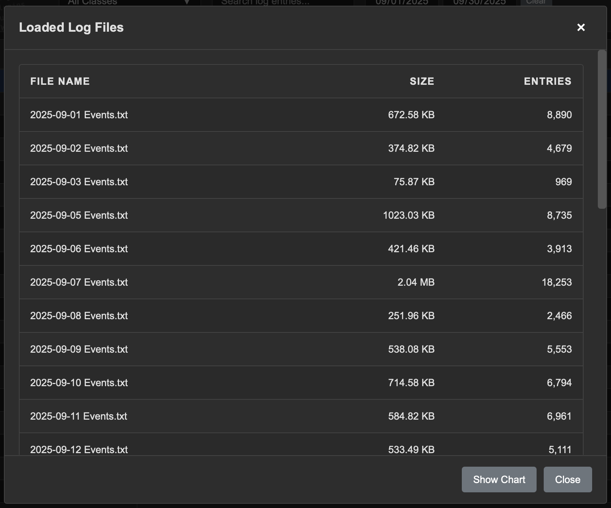
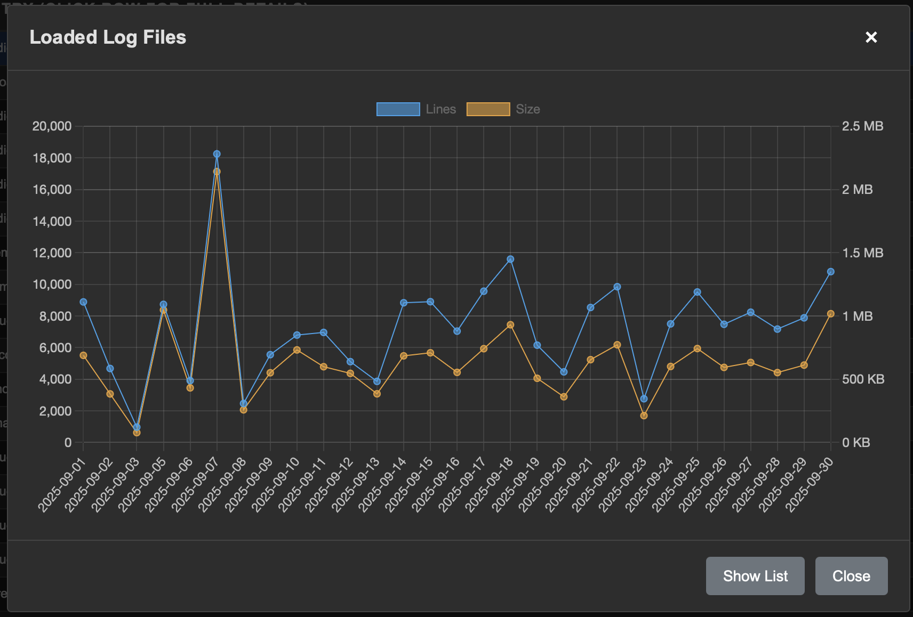

# Indigo Log Viewer


A simple, standalone web-based application for viewing Indigo smart home automation log files.



## Quick Start

1. Download the latest release from the releases page
2. Unzip the files into a folder
3. Double-click `log_viewer_app.html` (or use File > Open in your browser)
4. Click the hamburger menu and select "Choose Log Folder" or "Choose Log Files"
5. Browse and filter your logs

No installation, server, or build tools required.

## Features

- **Fast Performance**: Virtual scrolling handles 200,000+ log entries smoothly
- **Multiple File Support**: Load individual files, multiple files, or entire folders
- **Powerful Filtering**: Filter by date range, message class, and text search
- **Sortable Columns**: Click column headers to sort by timestamp or class
- **File Analytics**: View file info with list and chart visualizations
- **Keyboard Navigation**: Full keyboard support for efficient browsing
- **Light/Dark Themes**: Switch themes with your preference saved locally
- **Responsive Design**: Resizable columns to fit your workflow
- **Multi-line Support**: Properly handles multi-line log entries
- **No Dependencies**: Pure JavaScript with only Chart.js (loaded from CDN)

## Log Format

The viewer expects tab-delimited log entries in this format:

```
[Timestamp][Message Class][Message]
```

Example:
```text
YYYY-MM-DD HH:MM:SS.fff	Action Collection	Webhook Post/Form Received
```

Multi-line log entries (continuation lines without timestamps) are fully supported.

## System Requirements

- **Browser**: Tested on Safari 18.6; also loads in current Chrome and Firefox
- **Operating System**: macOS, Windows, Linux (any OS with a modern browser)
- **Screen Size**: Optimized for desktop/laptop screens
- **Network**: Can load files from network locations (performance may vary)

## Usage

### Quick File Access

**Choose Log Folder** — Opens a folder picker to load all Indigo log files in a directory.

**Choose Log Files** — Select multiple specific files at once, including non-contiguous files.

> **Note**: Log files are not monitored in real-time. To view new entries, reload the files using the menu.

### Serving from Indigo Web Server

For convenient access, serve the app from Indigo's built-in web server:

1. Copy all files to Indigo's Web Assets folder:
   ```bash
   /Library/Application Support/Perceptive Automation/Indigo XXXX.X/Web Assets/public/
   ```

2. Access the app via URL:
   ```
   https://localhost:8176/public/log_viewer_app.html
   ```

3. Create bookmarks or add links to Indigo control pages for quick access

> **Warning**: The public Web Assets folder is served without authentication. Anyone with access to your server's IP or reflector name can access these files. For authenticated access, use the static Web Assets folder instead. Note that users still need file system access to view your actual log files.

### Menu Options

Use the hamburger menu (☰) in the upper right corner to access features:

**File Info** — View detailed statistics about loaded files including name, size, and entry count. Toggle between list and chart views. In chart view, switch between line and bar chart styles using the **Bar Chart / Line Chart** button — your preference is saved across sessions. Click legend items to hide/show individual series.



*File Info — List View*



*File Info — Chart View*

**Light/Dark Theme** — Toggle between light and dark themes. Your preference is saved to browser local storage. Note that clearing browser cache may reset this setting.

**Help** — Opens the GitHub repository and this readme file.

**About** — Version and author information.

### Search and Filter Tools

**Class Filter** — Dynamically populated dropdown showing all message classes in your loaded files. By default, all classes are visible. Uncheck classes to hide them, or uncheck all and selectively re-enable specific classes.

**Text Search** — Find specific text strings. Search is case-insensitive and literal (regex patterns not supported). Results update in real-time as you type.

**Date Filter** — Limit entries to a specific date or date range. Click the <kbd>Clear</kbd> button to remove date restrictions.

### Viewing Area

Log entries are displayed in a virtual scrolling list for optimal performance. Features include:

**Sortable Columns** — Click the timestamp or class column headers to sort. Only one column can be sorted at a time.

**Resizable Columns** — Drag column borders to adjust width. Your preferences are saved locally.

**Entry Details** — Click any log entry to open it in a modal dialog. This is especially useful for multi-line entries that are truncated in the main view. Use the <kbd>Copy</kbd> button to copy the entire entry to your clipboard.


### Keyboard Shortcuts

The app supports full keyboard navigation:

| Key | Action |
|-----|--------|
| <kbd>↑</kbd> / <kbd>↓</kbd> | Navigate up/down through log entries |
| <kbd>Enter</kbd> | Open selected entry in modal |
| <kbd>Home</kbd> | Jump to first entry |
| <kbd>End</kbd> | Jump to last entry |
| <kbd>Page Up</kbd> / <kbd>Page Down</kbd> | Scroll one page up/down |
| <kbd>Esc</kbd> | Close modal or menu |

## Troubleshooting

**Files won't load**
- Ensure files follow the expected format (timestamp, class, message separated by tabs)
- Check that you're selecting Indigo log files (pattern: `YYYY-MM-DD Events.*` or `plugin.log*`)
- Try loading a single file first to isolate the issue

**Performance is slow**
- Loading from network locations can be slower depending on network speed and file size
- Very large log files (>1GB) may take time to parse
- Consider filtering by date range to reduce visible entries

**Filters not working**
- Text search uses literal matching (no regex) and is case-insensitive
- Class filter only shows classes present in loaded files
- Date filter requires properly formatted timestamps in the source files

**Theme or column widths reset**
- These preferences are stored in browser local storage
- Clearing browser cache/data will reset preferences
- Different browsers maintain separate settings

## Technical Details

- **Architecture**: Standalone HTML/CSS/JavaScript (no build system or framework)
- **External Dependencies**: Chart.js 4.5.0 (loaded from CDN)
- **Virtual Scrolling**: Only visible rows rendered for performance
- **Security**: All user content escaped to prevent XSS
- **File Loading**: FileReader API with automatic retry logic (3 attempts, exponential backoff)

## Support

### Reporting Issues

Found a bug or have a suggestion? Please report it using the [GitHub Issues](https://github.com/yourusername/IndigoLogViewer/issues) tab.

### Getting Help

1. Check the troubleshooting section above
2. Review this readme for feature documentation
3. Open an issue on GitHub with detailed information about your problem

---

> **Note**: The structure of this project has changed from the initial release. While it's still possible to manually copy project files individually, downloading the official release ZIP is the recommended approach.
